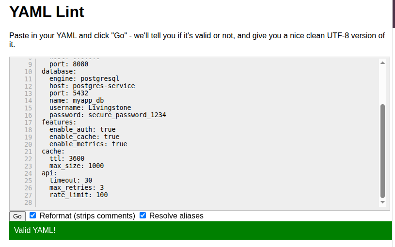
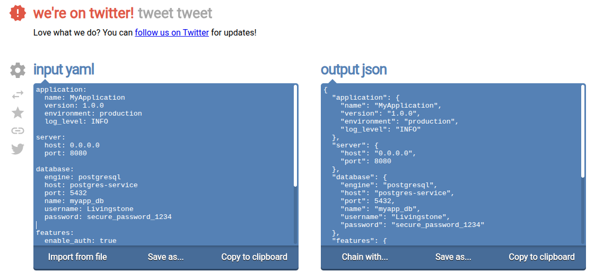
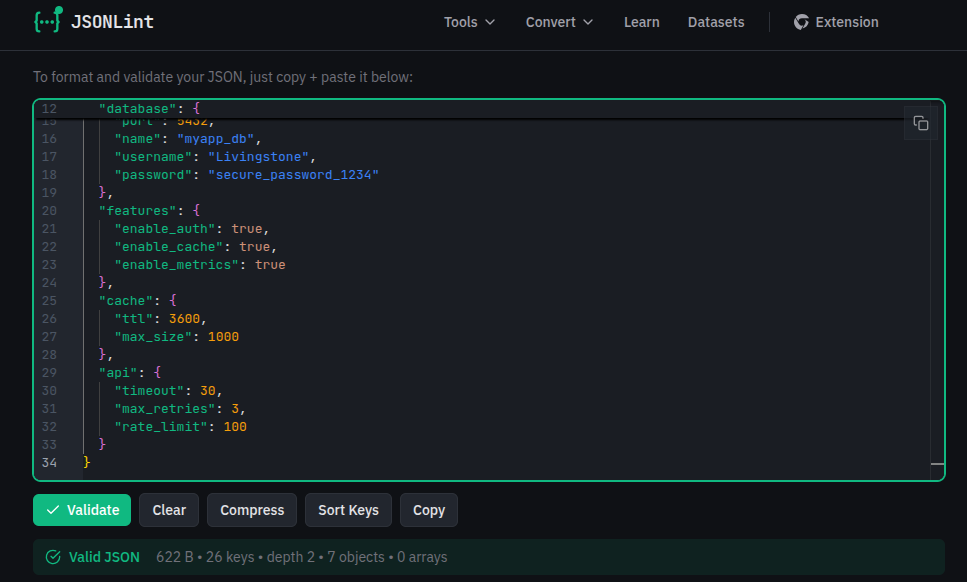

# YAML Configuration for an Application

A project demonstrating how to create, validate, and convert application configuration files using YAML and JSON formats.

## Objective

The objective of this lab is to learn how to construct well-formed configuration files using YAML syntax, validate them using online tools, and convert them to JSON format for data interchange.

## Overview

YAML (YAML Ain't Markup Language) and JSON (JavaScript Object Notation) are commonly used formats in cloud computing and DevOps for defining application settings, infrastructure configurations, and data exchange. This project focuses on creating a structured configuration file that defines application, server, database, and additional settings for a web application.

## Tools Used

- **Text Editor**: Visual Studio Code
- **YAML Validator**: [YAML Lint](https://www.yamllint.com/)
- **YAML to JSON Converter**: [Online YAML Tools](https://onlineyamltools.com/convert-yaml-to-json)
- **JSON Validator**: [JSON Lint](https://jsonlint.com/)

## Project Structure

```
YAML Config App/
├── app-config.yaml          # Main YAML configuration file
├── README.md                # Project documentation
├── Assets/                  # Validation screenshots
│   ├── YamlValidator.png
│   ├── YamlToJson.png
│   └── JsonValidator.png
└── Assignment.pdf           # Lab assignment requirements
```

## Procedure

### Step 1: Create the YAML Configuration File

Created a new file named `app-config.yaml` using Visual Studio Code. The configuration was structured into multiple sections: application, server, database, features, cache, and API settings.

### Step 2: Define Application Settings

The application section includes the application name, version, environment, and logging level. Proper indentation was used to indicate that these values belong to the application block.

```yaml
application:
  name: MyApplication
  version: 1.0.0
  environment: production
  log_level: INFO
```

### Step 3: Define Server Settings

The server section defines the host address and port number that the application listens on.

```yaml
server:
  host: 0.0.0.0
  port: 8080
```

### Step 4: Define Database Settings

The database section includes the database engine, host, port, database name, username, and password required for the application to connect to the database.

```yaml
database:
  engine: postgresql
  host: postgres-service
  port: 5432
  name: myapp_db
  username: Livingstone
  password: secure_password_1234
```

### Step 5: Define Additional Settings

Added feature flags, cache configuration, and API settings to demonstrate a more comprehensive configuration structure.

```yaml
features:
  enable_auth: true
  enable_cache: true
  enable_metrics: true

cache:
  ttl: 3600
  max_size: 1000

api:
  timeout: 30
  max_retries: 3
  rate_limit: 100
```

### Step 6: Validate the YAML File

The YAML file was validated using [YAML Lint](https://www.yamllint.com/) to ensure correct syntax and indentation. No errors were found, confirming the configuration is properly formatted.



### Step 7: Convert YAML to JSON

The validated YAML file was converted into JSON format using [Online YAML Tools](https://onlineyamltools.com/convert-yaml-to-json). The JSON file retained the same structure and values as the YAML file.



### Step 8: Validate the JSON File

The converted JSON file was validated using [JSON Lint](https://jsonlint.com/) to ensure the conversion was successful and the JSON syntax is correct.



## Results

The YAML configuration file was successfully:
- Created with proper indentation and structure
- Validated using YAML Lint with no errors
- Converted to JSON format while preserving all data
- Validated in JSON format to confirm correctness

The configuration file accurately represents the structure and parameters of a web application, including application metadata, server settings, database connection parameters, feature flags, cache settings, and API configuration.

## Conclusion

This lab demonstrated how to create, validate, and convert configuration files using YAML and JSON formats. Understanding these formats is essential for working with cloud platforms, DevOps tools, and modern applications. YAML provides excellent readability for configuration files, while JSON is widely used for data exchange between systems.

## Lessons Learned

- Proper indentation is critical in YAML files (spaces, not tabs)
- JSON has stricter syntax rules than YAML (requires quotes around strings)
- Online validation tools help prevent configuration errors before deployment
- YAML and JSON can represent the same data using different formats
- Configuration files should be well-structured and organized for maintainability

## Validation Tools Used

- **YAML Validator**: [https://www.yamllint.com/](https://www.yamllint.com/)
- **YAML to JSON Converter**: [https://onlineyamltools.com/convert-yaml-to-json](https://onlineyamltools.com/convert-yaml-to-json)
- **JSON Validator**: [https://jsonlint.com/](https://jsonlint.com/)

## Author

**Joel Livingstone Kofi Ackah**

- GitHub: [@KofiAckah](https://github.com/KofiAckah)
